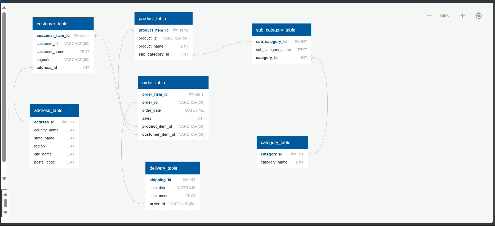
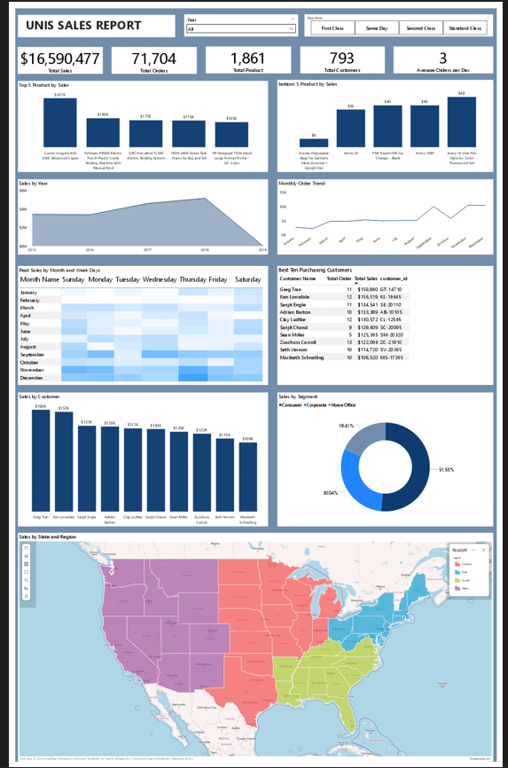

# UNIS Sales Management System

The UNIS Sales Management System is a relational database project built using PostgreSQL. It simulates the operations of a retail store by managing key entities such as products, customers, orders, and employees. The system is fully normalized (up to 3NF) and includes SQL queries for reporting and insights, along with Power BI dashboards for data visualization.

##  Key Features

- **Inventory and Product Management**:  product details, and  information.
- **Customer and Order Tracking**: Manage customer profiles, sales transactions, and order history.
- **Role-Based Access Control**: Utilize views and permissions to control access for different user roles.
- **Advanced SQL Queries**: Analyze sales performance, customer behavior, top-selling products, and revenue trends.
- **Power BI Dashboards**: Visualize KPIs and insights with interactive charts and reports.

## 🧰 Tech Stack

| Tool         | Purpose                                  |
|--------------|------------------------------------------|
| PostgreSQL   | Relational database design and storage   |
| SQL          | Data querying and analysis               |
| Power BI     | Data visualization and reporting         |
| Quickdb      | Entity Relationship Diagram (ERD) design |
|DBeaver       | Querying the database                    |

## Entity Relationship Diagram

## Dashbord

## 📁 Project Structure

unis-sales-management-system/
├── sample_data.sql
├── queries/
├── visualizations/
├── ERD/
└── README.md

## Project Documention 
For a detailed explanation of the project, check out the corresponding Medium article.

https://medium.com/@ebube_iroroh/database-design-and-analysis-on-sales-management-system-unis-1-fc0724e7c627

https://medium.com/@ebube_iroroh/insights-with-sql-power-bi-sales-management-system-unis-2-ca41332ae8a3

## 🤝 Contributions

Feedback or ideas? Feel free to open an issue or fork the repo.

## 📬 Contact

Reach me at [ebube.iroroh@gmail.com]

